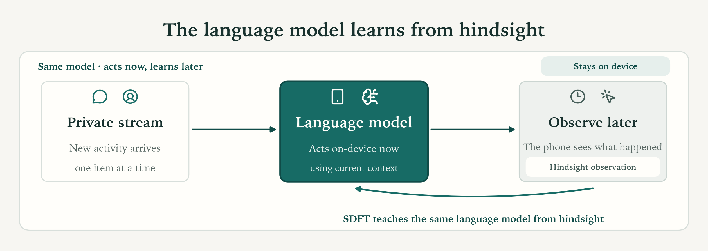

# Online-SDFT: On-Device Continual Learning from Hindsight

[](https://colab.research.google.com/github/lin826/Online-SDFT-Benchmark/blob/main/online_sdft_bandit_demo.ipynb)

Small language models now run on phones, but they stop learning the moment they
ship. The feedback that would personalize them arrives afterward, on the device,
and in an awkward form: delayed by minutes or hours, existing only for the
action the model actually took, and never a label. Standard fine-tuning wants a
batch and a target. On-device you get neither.

Self-distillation fits that gap unusually well. It needs no external teacher and
no gold answer, only the same model given more information. On a phone the
extra information is free: wait, and the user's own behavior tells you how the
decision turned out. So the teacher is the student rereading its own episode
with the outcome attached. One set of weights covers both roles: the adapter
is enabled to serve and disabled to teach.

```text
act on current context
  → observe the delayed, action-dependent outcome
  → same model rereads the episode with the outcome in view
  → distill a reliability-conditioned soft target into the adapter
  → serve the next request with the updated adapter
```



The testbed is push-notification routing: deliver now, hold for a digest, or
archive. It makes all three difficulties unavoidable at once. What matters is
the loop, not the particular action set.

## Results

Six methods on three paired synthetic streams
(`semantic-title-body-sharp-t001`, seeds 0–2, Apple MPS), 240 decisions each.

Every method sees the same decision-time context (notification title/body,
category, local time, regime, importance) and the same delayed callbacks.
Where they differ:

- **Base** serves the frozen model and never adapts.
- **ICL** and **RAG** change no weights. Both prompt only reliable singleton
  callbacks in the `causal_demos` format: ICL keeps the three latest, RAG
  retrieves three (`K=3`) on a 50/50 metadata and title/body blend.
- **REINFORCE**, **Rejection Fine-Tuning (RFT)**, and **Online-SDFT** all train
  the same reset rank-4 LoRA adapter over a frozen 230M base: 172,032
  parameters across 48 tensors, batches of at most eight. What separates them
  is the learning rule rather than capacity.

| Method | Sampled-preference accuracy | Cumulative utility gap | Observable reward / decision |
| --- | ---: | ---: | ---: |
| Base | 28.19% ± 2.33 | 164.67 ± 2.66 | 0.256 ± 0.140 |
| ICL | 42.22% ± 3.57 | 131.48 ± 0.60 | 0.008 ± 0.055 |
| RAG | 50.00% ± 7.37 | 106.62 ± 30.45 | 0.316 ± 0.389 |
| REINFORCE | 32.08% ± 2.06 | 157.99 ± 2.56 | -0.090 ± 0.176 |
| RFT | 52.78% ± 2.60 | 105.26 ± 15.32 | 0.364 ± 0.250 |
| **Online-SDFT** | **70.28% ± 2.60** | **44.76 ± 4.57** | **0.955 ± 0.082** |

Online-SDFT matched the hidden preference on 506 of 720 decisions. Against RFT, which
runs the same loop but insists on a verified hard label, it gains 17.50 points
and cuts the gap by 60.50. Most of that is data efficiency: RFT accepted only 75 of 311
teacher candidates (24.12%), since verification discards every ambiguous
callback, while a soft target keeps the graded information they still carry.

Scope: Online-SDFT and REINFORCE were tuned on these same three streams, with
no disjoint confirmation set, so the table ranks methods on the streams that
selected them. The intervals are nominal 95% confidence intervals over three
synthetic streams. Phone latency, energy, and battery come from the device
build described below.

## Run locally

```bash
python -m venv .venv
.venv/bin/pip install -r requirements.txt
.venv/bin/python run.py --device cpu
```

`--device mps` or `--device cuda` if you have it. The notebook embeds the
simulator, every method, and the audited artifacts: its local strict mode
reruns seeds 0–2 on the original MPS/FP32 stack and demands byte-for-byte
equality with the committed results, while Colab falls back to a portable
CUDA/CPU mode over a SHA-verified bundle of the same 720 events.

## On a real phone

[`android-demo/`](android-demo) is a separate Gradle project, a notification
router plus three test-publisher APKs, that runs the same loop on-device. The
frozen `LiquidAI/LFM2.5-230M` base makes each decision, and ONNX Runtime
Training updates the rank-4 adapter from genuine notification callbacks, with
adapter and replay state persisted in app-private storage across restarts.

Android's notification-listener APIs run after posting, so this demonstrates
post-time routing rather than guaranteed pre-alert suppression; calls, media
playback, and foreground services fail closed. The
[deployment guide](android-demo/README.md) has the build, provisioning,
learning-proof, privacy, and reset procedures.

## Where to look next

| | |
| --- | --- |
| [Colab notebook](https://colab.research.google.com/github/lin826/Online-SDFT-Benchmark/blob/main/online_sdft_bandit_demo.ipynb) | Run all six methods yourself, no install |
| [`docs/developer-guide.md`](docs/developer-guide.md) | Run your own learning rule, or a different model, on the benchmark |
| [`docs/`](docs) | Protocol, baselines, evaluation gates, and the observability audit |
| [`online_sdft/`](online_sdft) | Environment, evidence boundary, model, learners, causal loop |
| [`tests/`](tests) | Timing, observability, leakage, and update gates |
